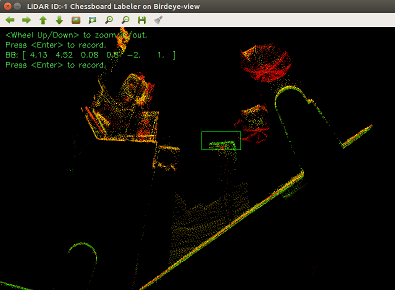
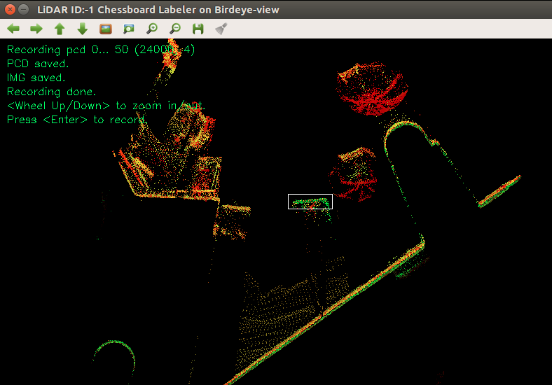

# Automatic Livox LiDAR-Camera Extrinsic Calibration
完全自动化的Livox LiDAR与相机外参标定工具。

## 1. Dependencies
以下环境在Ubuntu 16.04 64位 / Ubuntu 18.04 64位下测试通过.

对于求解外参的主程序，其依赖为
- python 2.X / 3.X
- [python-pcl](https://github.com/strawlab/python-pcl)
- opencv-pyhon (>= 4.0)
- scipy
- scikit-learn
- transforms3d
- pyyaml
- mayavi (optional, for debug and visualization only)

对于我们提供的可视化标定数据采集工具(可选)，其依赖为
- ROS (tested with kinetic / melodic)

## 2. Get started

### 2.1 代码准备
将这个repo clone到本地, 注意一定要将子模块也clone下来.

```Bash
git clone --recurse-submodules https://github.com/HViktorTsoi/ACSC
```

编译并安装normal-diff segmentation扩展.

```Bash
cd /path/to/your/ACSC
cd segmentation
python setup.py install
cd ..
```

### 2.2 代码文件信息
- ros/: 标定数据采集工具的workspace

- calibration.py: LiDAR-Camera外参计算程序

- projection_validation.py: 外参计算结果可视化验证程序

- utils.py: 工具代码

- config.yaml: 标定信息配置文件

## 3. 外参标定

### 3.1 准备工作
我们使用常见的[棋盘格标定板](./images/calib.io_checker_640x480_6x8_80.pdf)作为标定目标物.


为了保证标定的成功率，标定板的制作和放置最好保证满足以下几点特性：
1. 标定板中每个方格的尺寸不要小于8cm；

2. 标定板用白色纸打印出来，贴在不会变形的矩形表面上；

3. 标定板棋盘格的四周不要有多余的白色边框；

4. 标定板应放置于较细的独脚架上，或者用细线悬挂于半空。并且在标定过程中，由于需要对标定板处的点云进行叠加，所选择的支撑物要尽量稳定，不会晃动；

5. 在脚架上放置标定板时，板子的下边沿尽量平行于地面；

6. 标定板的四周半径3m以内尽量不要有遮挡物，否则会影响分割性能；

标定板放置


传感器部署


另外，如果你在使用livox的mid40、mid100或者horizon等系列的产品，我们强烈建议在标定过程中将LiDAR的回波模式改为最强模式，以降低边缘噪点对标定板检测的影响，请参考[livox ros driver文档](https://github.com/Livox-SDK/livox_ros_driver#5-configure-lidar-parameters).

### 3.2 标定数据格式要求
为了实现外参标定，我们需要将图像和LiDAR点云数据组织成以下格式:

```
|- data_root
|-- images
|---- 000000.png
|---- 000001.png
|---- ......
|-- pcds
|---- 000000.npy
|---- 000001.npy
|---- ......
|-- distortion
|-- intrinsic

```
其中images目录下是相机记录下来的包含不同位置标定板的图像; 

pcds目录下是与图像对应的点云构成的numpy array, shape是Nx4，每一行分别是点的x,y,z和反射率信息；

> 这里需要注意的是，对于标定板摆放的每一个位置，点云都应该叠加50帧以上, 以保证标定板处的点云是稠密的；即对于pcds下的每一个npy文件，比如000000.npy，都应该是若干帧点云的numpy array在row axis方向拼接之后再保存下来的。

distortion和intrinsic分别是相机的畸变参数和内参(会在3.4详细描述)。

### 3.3 标定数据采集
我们开发了ROS下的实用工具，来实现更方便的标定数据采集，并且自动地将数据组织成3.2描述的形式，我们强烈建议您使用这一工具来简化标定流程。如果您不使用ROS也没关系，只要手动将图像和点云数据处理成3.1的格式就可以。

首先进入数据采集工具的目录并编译:
```Bash
cd /path/to/your/livox_camera_calibration

cd ros/livox_calibration_ws

catkin_make

source ./devel/setup.zsh # 或者 source ./devel/setup.sh
```

然后确保现在ROS下能够接收到到LIVOX LiDAR和camera对应topic的数据，运行数据采集的launch文件:

```Bash
mkdir /tmp/data

roslaunch calibration_data_collection lidar_camera_calibration.launch \
config-path:=/path/to/your/ACSC/configs/data_collection.yaml \
image-topic:=/mynteye/image \
lidar_topic:=/livox/lidar \
saving_path:=/tmp/data
```
其中，config_path是配置文件路径，通常情况下使用项目根目录下的config/data_collection.yaml的即可;

image_topic和lidar_topic分别是接受相机图像和LiDAR点云的topic name；

saving_path是标定数据暂存的目录。

成功运行之后，你应该可以看到以下两个界面，分别是LiDAR的鸟瞰投影，以及相机的图像。如果这两个界面有任何一个显示不正常，请检查你的LiDAR topic以及camera topic，是否能够正常的收到数据。


将标定板摆放在不同位置，放置好之后，在LiDAR鸟瞰投影的界面观察标定板的位置，确保其在LiDAR和相机的视野范围之内，按Enter记录数据；此时需要等一段时间，等待点云叠加完毕，当屏幕提示记录数据完成后，更换标定板的位置，继续记录下一组数据。

为了保证标定结果的鲁棒性，标定板的摆放位置应该满足以下条件:

1. 标定板距离LiDAR至少2米以上；

2. 标定板应至少放置在6个以上的位置， 分别是近距离(4m左右)的左侧、中间、右侧，以及远距离(8m)的左侧、中间、右侧；

3. 在每个位置上，标定板最好有3个不同的朝向，分别是正对相机/LiDAR，向左旋转，以及向右旋转，这样一共需要采集约20对不同位置和朝向的图像-点云数据。

当全部标定数据采集完成之后，在运行roslaunch的终端键入CTRL+C，关闭标定工具. 

此时在我们指定的标定数据存储目录下应该能够看到以时间戳命名的新生成data文件夹，其中images中保存了图像，pcds保存了叠加的点云文件。


### 3.4 获取相机内参
目前相机内参标定的工具有很多， 这里我们建议使用ROS的[camera calibration tools](http://wiki.ros.org/camera_calibration)，或者MATLAB的[Camera Calibrator App](https://www.mathworks.com/help/vision/ug/single-camera-calibrator-app.html)进行内参的标定。

标定完成后，将相机内参写入到data_root下边的intrinsic文件中，写完之后其格式应如下图所示，


将相机畸变参数写入data_root下边的distortion文件中，写完之后其格式应如下图所示，


### 3.5 外参标定
当你完成3.1~3.4的所有步骤之后，data_root目录下应该包含如下内容：


如果缺少某些文件，请仔细确认3.1~3.4中的步骤是否全部完成。

修改config目录下的标定配置文件, 这里以[sample.yaml](./config.yaml)为例子:

1. 将`data`下的`root`修改为3.1~3.4中采集的数据根目录，在我们的例子中，这个目录应该是`/tmp/data/1595233229.25`;

2. 修改`data`下的`chessboard`参数，将`W`和`H`改为你实际使用的棋盘格的内角点数(注意不是方格数，而是内角点数，对于3.1中的棋盘，W=7, H=5); 将`GRID_SIZE`修改为测量得到的棋盘小方格长度(单位是m);

运行外参标定程序:

```Bash
python3 calibration.py --config ./configs/sample.yaml
```

外参计算结束之后，外参矩阵会被写入到指定的data_root下的parameter/extrinsic文件中。


## 4. 标定结果验证

完成步骤3.的外参标定后，运行projection_projection.py来检验标定是否准确:
```Bash
python3 projection_validation.py --config ./configs/sample.yaml
```
会显示点云根据内外参投影到图像上之后的融合图像, 使用相机图像进行RGB着色之后的点云，以及检测得到的3D角点重投影回图像的可视化结果和计算得到的RMSE。

> 注意，只有安装mayavi之后才会显示点云着色的3D可视化结果。

Horizon LiDAR点云投影


Horizon点云着色


Mid100 LiDAR点云投影


Mid100 LiDAR点云着色


3D角点重投影结果


## 附录

### I. 半自动化外参标定(可选)
如果因为场景的问题导致标定板分割失败，我们同样提供了半自动化的标注方法，以实现更加准确的标定板定位。

半自动标定的过程也非常简单，只需要在采集标定数据的过程中指定出标定板的大概位置即可，具体方法如下:

1. 在config.yaml中，将`marker`下的`AUTOMATIC_CHESSBOARD_LOCALIZATION`设置为`False`;

2. 按照3.3的方法，启动LiDAR鸟瞰图和相机可视化的GUI
```Bash
roslaunch calibration_data_collection lidar_camera_calibration.launch \
config-path:=/path/to/your/livox_camera_calibration/config.yaml \
image-topic:=/mynteye/image \
lidar_topic:=/livox/lidar \
saving_path:=/tmp/data
```

3. 将标定板的位置摆放好之后， 在LiDAR鸟瞰投影的GUI中找到标定板的位置，双击鼠标左键新建一个标定框将标定板框选出来；



再次双击鼠标左键完成框选；然后按回车键开始记录数据。待数据记录完毕后，更换标定板的位置和朝向，再次标定和记录下一组数据(过程和3.5相同)。



4. 采集数据之后，复制内参矩阵、计算外参和外参验证的过程与之前全自动标注的过程完全一致。

### II. Tested sensor combination 

| No. |    LiDAR   | Camera | Chessboard Pattern | 
|:---:|:----------------:|:------------:|:------------:|
|  1  | [LIVOX Horizon](https://github.com/Livox-SDK/livox_ros_driver) |   [MYNTEYE-D](https://github.com/slightech/MYNT-EYE-D-SDK) 120   |      7x5, 0.08m     | 
|  2  | LIVOX Horizon |   MYNTEYE-D 120   |      7x5, 0.15m     | 
|  3  | LIVOX Horizon |   AVT Mako G-158C   |      7x5, 0.08m     | 
|  4  | LIVOX Horizon |   Pointgrey CM3-U3-31S4C-CS   |      7x5, 0.08m     | 
|  5  | [LIVOX Mid-40](https://github.com/Livox-SDK/livox_ros_driver)  |   MYNTEYE-D 120   |      7x5, 0.08m      |
|  6  | LIVOX Mid-40  |   MYNTEYE-D 120   |      7x5, 0.15m      |
|  7  | LIVOX Mid-40  |   AVT Mako G-158C   |      7x5, 0.08m      |
|  8  | LIVOX Mid-40  |   Pointgrey CM3-U3-31S4C-CS   |      7x5, 0.08m      |
|  9  | [LIVOX Mid-100](https://github.com/Livox-SDK/livox_ros_driver)  |   MYNTEYE-D 120   |      7x5, 0.08m      |
|  10  | LIVOX Mid-100  |   MYNTEYE-D 120   |      7x5, 0.15m      |
|  11  | LIVOX Mid-100  |   AVT Mako G-158C   |      7x5, 0.08m      |
|  12  | LIVOX Mid-100  |   Pointgrey CM3-U3-31S4C-CS   |      7x5, 0.08m      |
|  13  | [RoboSense ruby](https://github.com/RoboSense-LiDAR/rslidar_sdk)  |   MYNTEYE-D 120   |      7x5, 0.08m      |
|  14  | RoboSense ruby  |   AVT Mako G-158C   |      7x5, 0.08m      |
|  15  | RoboSense ruby  |   Pointgrey CM3-U3-31S4C-CS   |      7x5, 0.08m      |
|  16  | [RoboSense RS32](https://github.com/RoboSense-LiDAR/rslidar_sdk)  |   MYNTEYE-D 120   |      7x5, 0.08m      |
|  17  | RoboSense RS32  |   AVT Mako G-158C   |      7x5, 0.08m      |
|  18  | RoboSense RS32  |   Pointgrey CM3-U3-31S4C-CS   |      7x5, 0.08m      |

### III. Q&A

