# ACSC
Automatic extrinsic calibration for non-repetitive scanning solid-State LiDAR and camera systems.

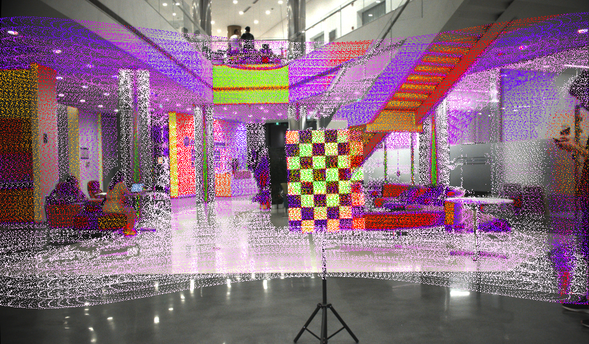

#### System Architecture
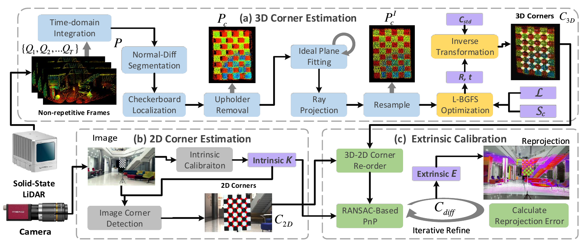
## 1. Dependency
Tested with Ubuntu 16.04 64-bit and Ubuntu 18.04 64-bit.

- ROS (tested with kinetic / melodic)

- python 2.X / 3.X

- [python-pcl](https://github.com/strawlab/python-pcl)

- opencv-python (>= 4.0)

- scipy

- scikit-learn

- transforms3d

- pyyaml

- mayavi (optional, for debug and visualization only)


## 2. Preparation

### 2.1 Download and installation
Use the following commands to download this repo. 

**Notice**: the **SUBMODULE** should also be cloned.

```Bash
git clone --recurse-submodules https://github.com/HViktorTsoi/ACSC
```

Compile and install the **normal-diff segmentation** extension.

```Bash
cd /path/to/your/ACSC/segmentation

python setup.py install
```

We developed a practical ROS tool to achieve convenient calibration data collection,
which can automatically organize the data into the format in 3.1. **We strongly recommend that you use this tool to simplify the calibration process.**

> It ok if you don't have ROS and don't use the provide tool, just manually process the images and point clouds into 3.1's format.

First enter the directory of the collection tool and run the following command:
```Bash
cd /path/to/your/ACSC/ros/livox_calibration_ws

catkin_make

source ./devel/setup.zsh # or source ./devel/setup.sh
```

#### File explanation 
- `ros/`: The data collection tool directory (A ros workspace); 

- `configs/`: The directory used to store configuration files;

- `calibration.py`: The main code for solving extrinsic parameters;

- `projection_validation.py`: The code for visualization and verification of calibration results;

- `utils.py`: utilities.

#### Sample Data
Coming in 1 week.

### 2.2 Preparing the calibration board
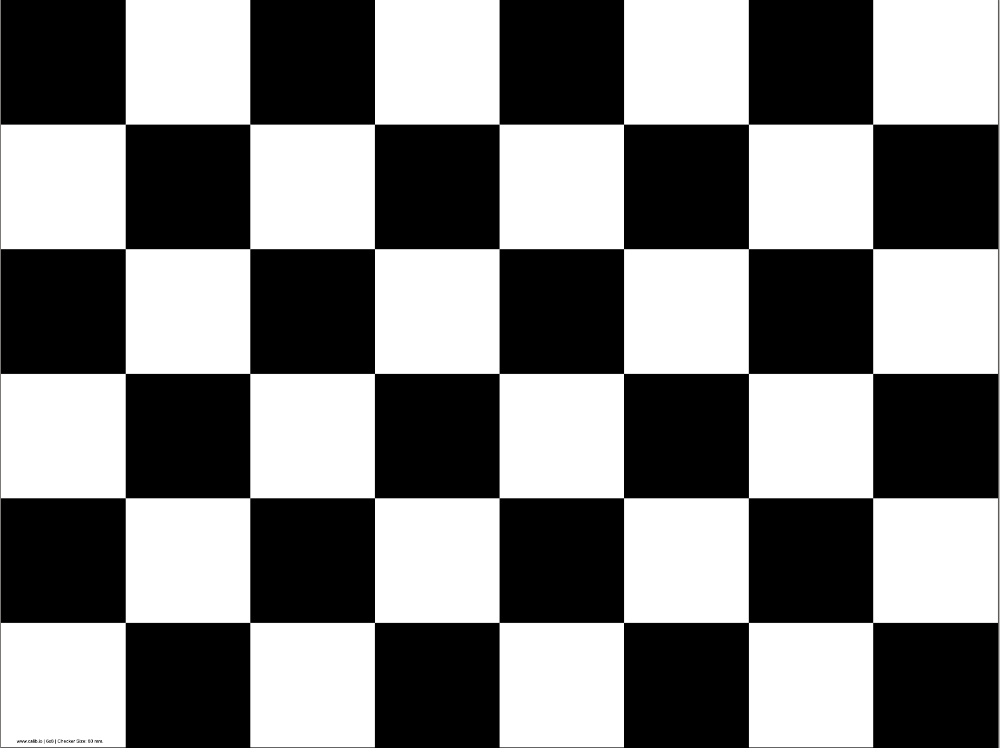

We use a common [checkerboard](./images/calib.io_checker_640x480_6x8_80.pdf) as the calibration target.

Notice, to ensure the success rate of calibration, 
it is best to meet the following requirement, when making and placing the calibration board:

1. The size of the black/white square in the checkerboard should be >= 8cm;

2. The checkerboard should be printed out on white paper, and pasted on a rectangular surface that will not deform;

3. There are not supposed to be extra white borders around the checkerboard;

4. The checkerboard should be placed on a thin monopod, or suspended in the air with a thin wire. 
And during the calibration process, the support should be as stable as possible (Due to the need for point cloud integration);

5.  When placing the checkerboard on the base, the lower edge of the board should be parallel to the ground;

6. There are not supposed to be obstructions within 3m of the radius of the calibration board.


#### Checkerboard placement
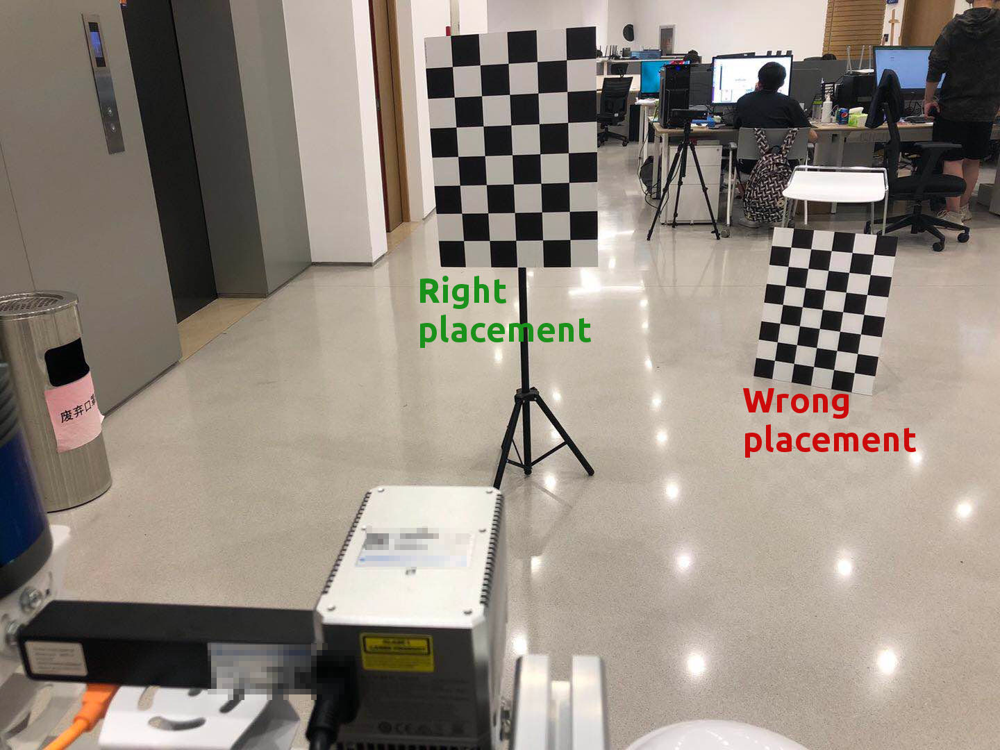

#### Sensor setup
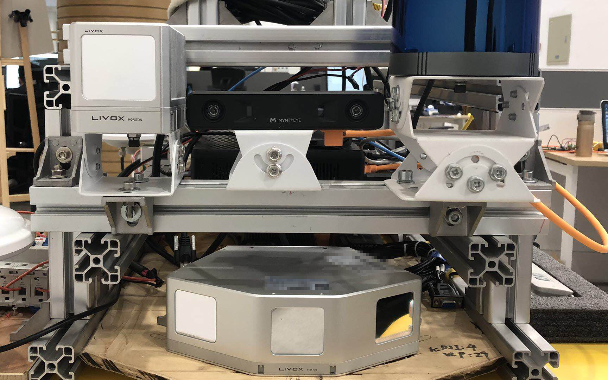


## 3. Extrinsic Calibration

### 3.1 Data format
The images and LiDAR point clouds data need to be organized into the following format:

```
|- data_root
|-- images
|---- 000000.png
|---- 000001.png
|---- ......
|-- pcds
|---- 000000.npy
|---- 000001.npy
|---- ......
|-- distortion
|-- intrinsic

```
Among them, the `images` directory contains images containing checkerboard at different placements, recorded by the camera ;

The `pcds` directory contains point clouds corresponding to the images,  each point cloud is a numpy array, with the shape of `N x 4`,
 and each row is the `x`, `y`, `z` and `reflectance` information of the point;

The `distortion` and `intrinsic` are the distortion parameters and intrinsic parameters of the camera respectively (will be described in detail in 3.3).

### 3.2 Data collection

First, make sure you can receive data topics from the the Livox LiDAR and Camera;

Run the launch file of the data collection tool:

```Bash
mkdir /tmp/data

cd /path/to/your/ACSC/ros/livox_calibration_ws
source ./devel/setup.zsh # or source ./devel/setup.sh

roslaunch calibration_data_collection lidar_camera_calibration.launch \                                                                                
config-path:=/home/hvt/Code/livox_camera_calibration/configs/data_collection.yaml \
image-topic:=/camera/image_raw \
lidar-topic:=/livox/lidar \
saving-path:=/tmp/data
```

Here, `config-path` is the path of the configuration file, usually we use `configs/data_collection.yaml`, and leave it as default;

The `image-topic` and `lidar-topic` are the topic names that we receive camera images and LiDAR point clouds, respectively;

The `saving-path` is the directory where the calibration data is temporarily stored.

After launching, you should be able to see the following two interfaces, which are the real-time camera image, and the birdeye projection of LiDAR.

If any of these two interfaces is not displayed properly, please check your`image-topic` and `lidar-topic` to see if the data can be received normally.


Place the checkerboard, observe the position of the checkerboard on the LiDAR birdeye view interface, to ensure that it is within the FOVof the LiDAR and the camera.
 
Then, press `<Enter>` to record the data; you need to wait for a few seconds, after the point cloud is collected and integrated, and the screen prompts that the data recording is complete, change the position of the checkerboard and continue to record the next set of data.

To ensure the robustness of the calibration results, the placement of the checkerboard should meet the following requirement:

1. The checkerboard should be at least 2 meters away from the LiDAR;

2. The checkerboard should be placed in at least 6 positions, which are the left, middle, and right sides of the short distance (about 4m), and the left, middle, and right sides of the long distance (8m);

3. In each position, the calibration plate should have 2~3 different orientations.

When all calibration data is collected, type `Ctrl+c` in the terminal to close the calibration tool.

At this point, you should be able to see the newly generated data folder named with `saving-path` that we specified, where images are saved in `images`, and point clouds are saved in `pcds`:

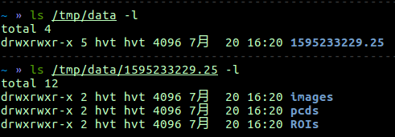

### 3.3 Camera intrinsic parameters
There are many tools for camera intrinsic calibration, here we recommend using the [Camera Calibrator App](https://www.mathworks.com/help/vision/ug/single-camera-calibrator-app.html) in MATLAB, or the [Camera Calibration Tools](http://wiki.ros.org/camera_calibration) in ROS, to calibrate the camera intrinsic.

Write the camera intrinsic matrix

```
fx s x0
0 fy y0
0  0  1
```

into the `intrinsic` file under `data-root`. The format should be as shown below:

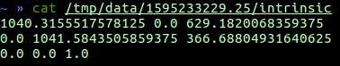

Write the camera distortion vector 

```
k1  k2  p1  p2  k3
```

 into the `distortion` file under `data-root`. The format should be as shown below:

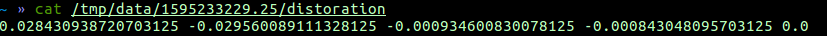


### 3.4 Extrinsic Calibration

When you have completed all the steps in 3.1 ~ 3.3, the `data-root` directory should contain the following content:

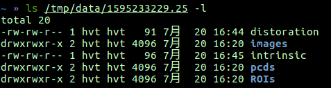

If any files are missing, please confirm whether all the steps in 3.1~3.3 are completed.

Modify the calibration configuration file in directory `config`, here we take [sample.yaml](./config.yaml) as an example:

1. Modify the `root` under `data`, to the root directory of data collected in 3.1~3.3. In our example, `root` should be `/tmp/data/1595233229.25`;

2. Modify the `chessboard` parameter under `data`, change `W` and `H` to the number of inner corners of the checkerboard that you use (note that, it is not the number of squares, but the number of inner corners. For the checkerboard in 3.1, W= 7, H=5); 
Modify `GRID_SIZE` to the side length of the squares of the checkerboard (unit is m);


Then, run the extrinsic calibration code:

```Bash
python calibration.py --config ./configs/sample.yaml
```
After calibration, the extrinsic parameter matrix will be written into the `parameter/extrinsic `file under `data-root`.
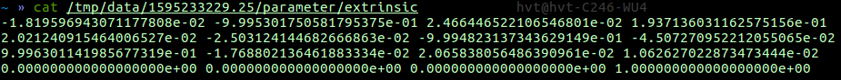

## 4. Validation of result

After extrinsic calibration of step 3, run `projection_projection.py` to check whether the calibration is accurate:
```Bash
python projection_validation.py --config ./configs/sample.yaml
```
It will display the point cloud reprojection to the image with solved extrinsic parameters, 
the RGB-colorized point cloud, and the visualization of the detected 3D corners reprojected to the image.
> Note that, the 3D point cloud colorization results will only be displayed if `mayavi` is installed.

#### Reprojection of Livox Horizon Point Cloud
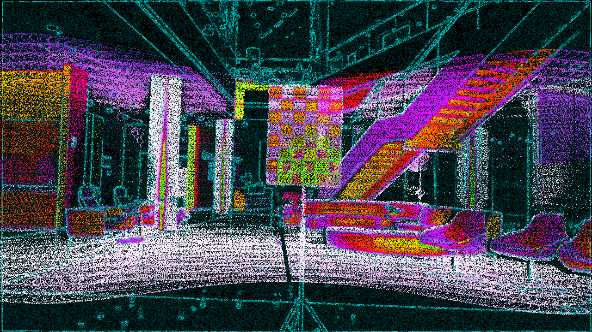


#### Reprojection Result of Livox Mid100 Point Cloud
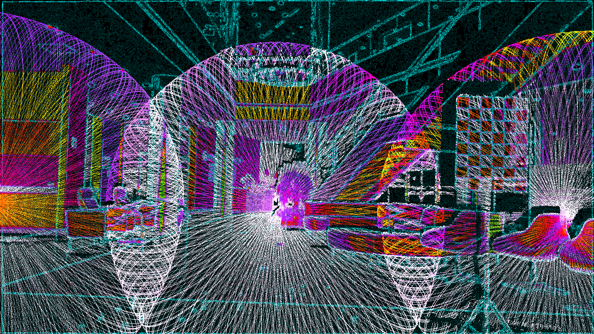

#### Reprojection Result of Livox Mid40 Point Cloud
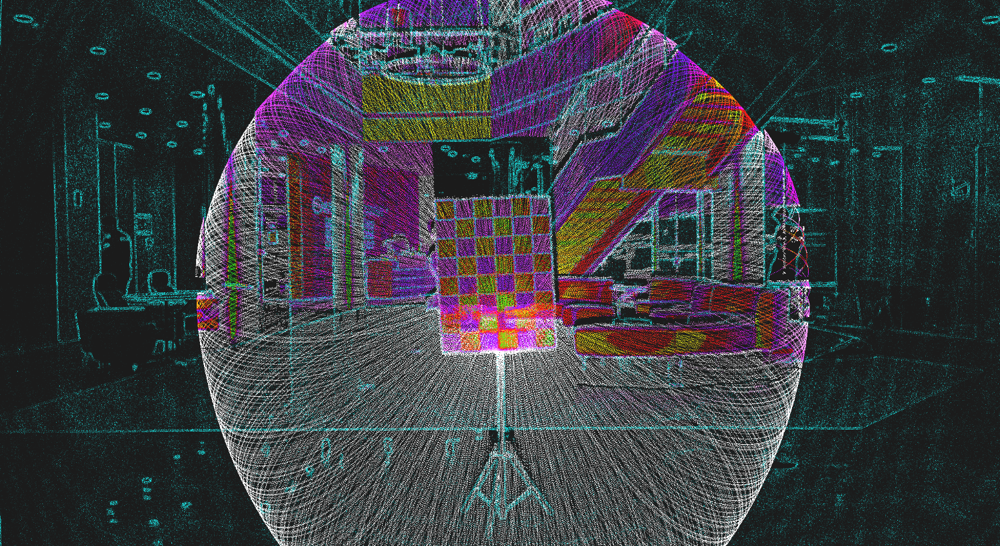

#### Colorized Point Cloud
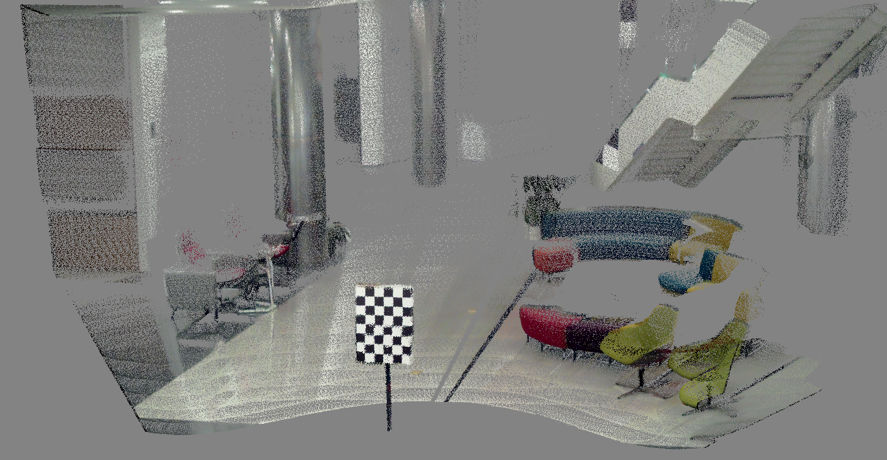

#### Detected Corners
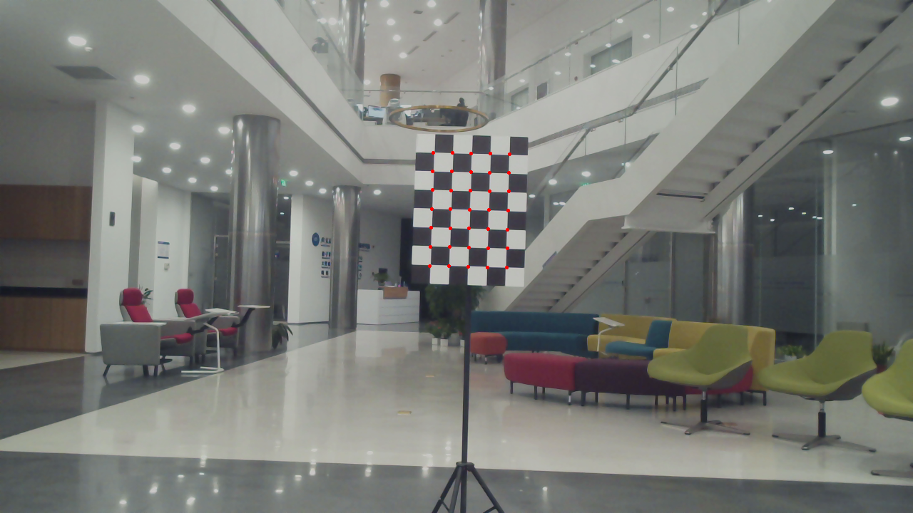
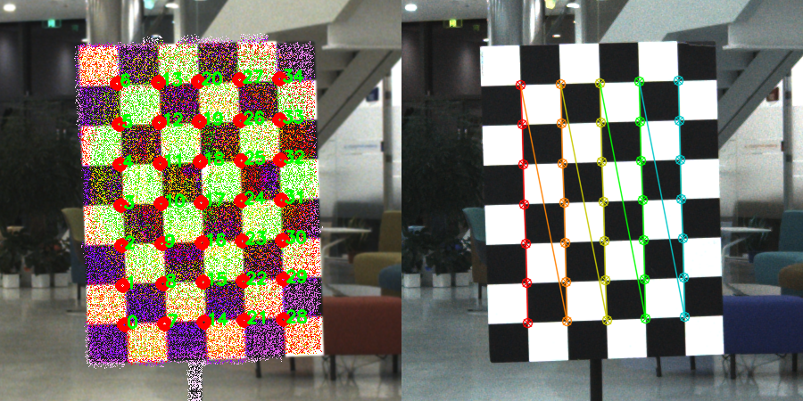

## Appendix

### I. Tested sensor combinations

| No. |    LiDAR   | Camera | Chessboard Pattern | 
|:---:|:----------------:|:------------:|:------------:|
|  1  | [LIVOX Horizon](https://github.com/Livox-SDK/livox_ros_driver) |   [MYNTEYE-D](https://github.com/slightech/MYNT-EYE-D-SDK) 120   |      7x5, 0.08m     | 
|  2  | LIVOX Horizon |   MYNTEYE-D 120   |      7x5, 0.15m     | 
|  3  | LIVOX Horizon |   AVT Mako G-158C   |      7x5, 0.08m     | 
|  4  | LIVOX Horizon |   Pointgrey CM3-U3-31S4C-CS   |      7x5, 0.08m     | 
|  5  | [LIVOX Mid-40](https://github.com/Livox-SDK/livox_ros_driver)  |   MYNTEYE-D 120   |      7x5, 0.08m      |
|  6  | LIVOX Mid-40  |   MYNTEYE-D 120   |      7x5, 0.15m      |
|  7  | LIVOX Mid-40  |   AVT Mako G-158C   |      7x5, 0.08m      |
|  8  | LIVOX Mid-40  |   Pointgrey CM3-U3-31S4C-CS   |      7x5, 0.08m      |
|  9  | [LIVOX Mid-100](https://github.com/Livox-SDK/livox_ros_driver)  |   MYNTEYE-D 120   |      7x5, 0.08m      |
|  10  | LIVOX Mid-100  |   MYNTEYE-D 120   |      7x5, 0.15m      |
|  11  | LIVOX Mid-100  |   AVT Mako G-158C   |      7x5, 0.08m      |
|  12  | LIVOX Mid-100  |   Pointgrey CM3-U3-31S4C-CS   |      7x5, 0.08m      |
|  13  | [RoboSense ruby](https://github.com/RoboSense-LiDAR/rslidar_sdk)  |   MYNTEYE-D 120   |      7x5, 0.08m      |
|  14  | RoboSense ruby  |   AVT Mako G-158C   |      7x5, 0.08m      |
|  15  | RoboSense ruby  |   Pointgrey CM3-U3-31S4C-CS   |      7x5, 0.08m      |
|  16  | [RoboSense RS32](https://github.com/RoboSense-LiDAR/rslidar_sdk)  |   MYNTEYE-D 120   |      7x5, 0.08m      |
|  17  | RoboSense RS32  |   AVT Mako G-158C   |      7x5, 0.08m      |
|  18  | RoboSense RS32  |   Pointgrey CM3-U3-31S4C-CS   |      7x5, 0.08m      |

### II. Q&A

